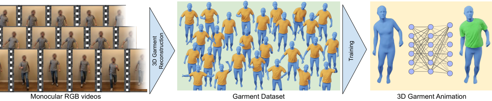

# PERGAMO



[[Project website](https://mslab.es/projects/PERGAMO)]
[[Dataset](https://urjc-my.sharepoint.com/:f:/g/personal/andres_casado_urjc_es/EuNAwoSGWD5HtT6AsgL8vJcByupY0Tsx4n95vVlh0CDKsw)]
[[Video](https://www.youtube.com/watch?v=giaHHW6R6pk)]

## Abstract

> Clothing plays a fundamental role in digital humans. Current approaches to animate 3D garments are mostly based on
> realistic physics simulation, however, they typically suffer from two main issues: high computational run-time cost,
> which hinders their development; and simulation-to-real gap, which impedes the synthesis of specific real-world cloth
> samples. To circumvent both issues we propose PERGAMO, a data-driven approach to learn a deformable model for 3D
> garments from monocular images. To this end, we first introduce a novel method to reconstruct the 3D geometry of
> garments from a single image, and use it to build a dataset of clothing from monocular videos. We use these 3D
> reconstructions to train a regression model that accurately predicts how the garment deforms as a function of the
> underlying body pose. We show that our method is capable of producing garment animations that match the real-world
> behaviour, and generalizes to unseen body motions extracted from motion capture dataset.

## Install instructions

IGL only supports and recommends the use of Anaconda. However, the environment can be set up using only `pip`
by installing the IGL bindings from source.

The general steps are as follows:

1. Install PyTorch according to your system
2. See the `requirements.txt` file to check the needed packages
    - This is usually done with `pip install -r requirements.txt`, but Anaconda may have a different way of doing things
3. Install IGL bindings ( https://github.com/libigl/libigl-python-bindings )
4. Install Kaolin ( https://kaolin.readthedocs.io/en/latest/notes/installation.html )

PERGAMO needs SMPL. You can download it from [SMPL](https://smpl.is.tue.mpg.de/). Rename the file from
`basicmodel_neutral_lbs_10_207_0_v1.1.0.pkl` to `smpl_neutral.pkl` and save it under `data/smpl/`.

## Datasets

You can download a dataset
from [OneDrive](https://urjc-my.sharepoint.com/:f:/g/personal/andres_casado_urjc_es/EuNAwoSGWD5HtT6AsgL8vJcByupY0Tsx4n95vVlh0CDKsw)
.

Datasets are made by processing each frame with:

- ExPose (output is SMPL-X, they need to be converted to SMPL too)
- PifuHD
- Self-Correction-Human-Parsing

## Running the project

To run the reconstruction, please check out `run_recons.sh`.

To run the regression, there are 2 sets of 3 scripts. Please check out `run_regression.sh` to see how it works.

## Citation

```
@article {casado2022pergamo,
    journal = {Computer Graphics Forum (Proc. of SCA), 2022},
    title = {{PERGAMO}: Personalized 3D Garments from Monocular video},
    author = {Casado-Elvira, Andrés and Comino Trinidad, Marc and Casas, Dan},
    year = {2022}
}
```
